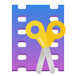
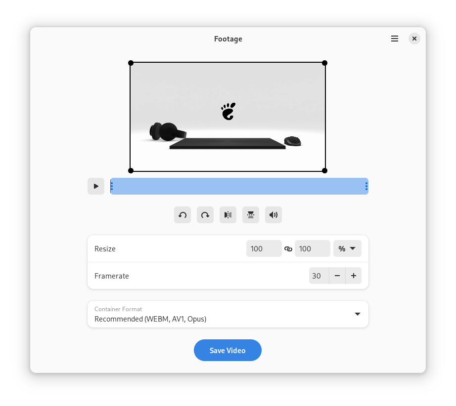

<div align="center">
<h1>Footage</h1>

Polish your videos.



[](https://flathub.org/apps/details/io.gitlab.adhami3310.Footage)
[](https://gitlab.com/adhami3310/Footage/-/tags)
[](https://gitlab.com/adhami3310/Footage/-/raw/main/COPYING)

</div>


## Installation
<a href='https://flathub.org/apps/details/io.gitlab.adhami3310.Footage'></a>


### Third Party Packages
You may also be able to obtain Footage from your distribution's package manager. Note these packages are maintained independently and thus may differ from the official version on Flathub. Please report any issues experienced to the package maintainer.

[](https://repology.org/project/footage/versions)


## About

Trim, flip, rotate and crop individual clips. Footage is a useful tool for quickly editing short videos and screencasts. It's also capable of exporting any video into a format of your choice. See [Press](PRESS.md) for content mentioning Footage from various writers, content creators, etc.



## Contributing
Issues and merge requests are more than welcome. However, please take the following into consideration:

- This project follows the [GNOME Code of Conduct](https://wiki.gnome.org/Foundation/CodeOfConduct)
- Only Flatpak is supported

## Development

### GNOME Builder
The recommended method is to use GNOME Builder:

1. Install [GNOME Builder](https://apps.gnome.org/app/org.gnome.Builder/) from Flathub
1. Open Builder and select "Clone Repository..."
1. Clone `https://gitlab.com/adhami3310/Footage.git` (or your fork)
1. Press "Run Project" (▶) at the top, or `Ctrl`+`Shift`+`[Spacebar]`.

### Flatpak
You can install Footage from the latest commit:

1. Install [`org.flatpak.Builder`](https://github.com/flathub/org.flatpak.Builder) from Flathub
1. Clone `https://gitlab.com/adhami3310/Footage.git` (or your fork)
1. Run `flatpak run org.flatpak.Builder --install --user --force-clean build-dir io.gitlab.adhami3310.Footage.json` in the terminal from the root of the repository.

### Meson
You can build and install on your host system by directly using the Meson buildsystem:

1. Install `blueprint-compiler` and other relevant codecs.
1. Run the following commands (with `/usr` prefix):
```
meson --prefix=/usr build
ninja -C build
sudo ninja -C build install
```

## Credits

Actively developed by Khaleel Al-Adhami.

Logo desgined by kramo.

Huge thanks to all of the translators who brought Footage to many other languages!